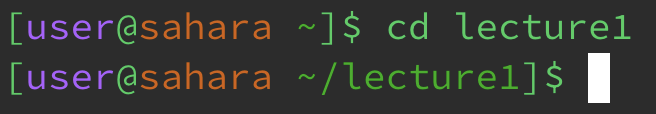

The working directory is `/home`

I got an empty output because I was not cd-ing into anything.

This example was not an error.

The working directory was `/home`

My prompt changed to `/home/lecture1` because when you pass a directory as an argument for `cd` it changes your directory to the argument.

This example was not an error. 
