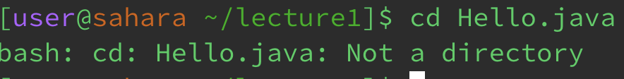
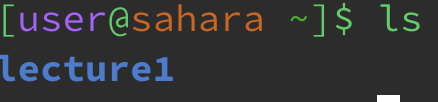
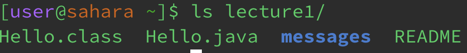
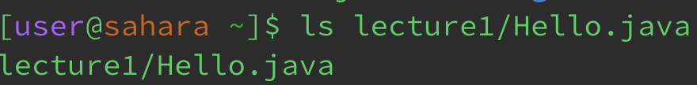
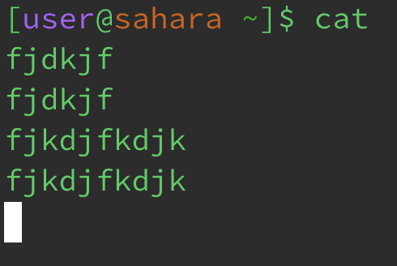
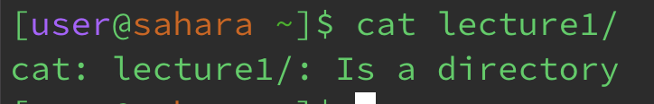
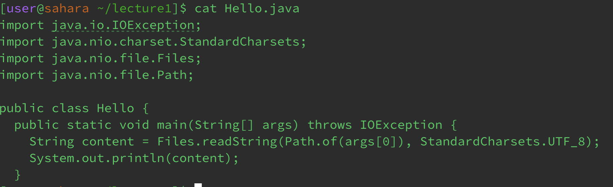

The working directory is `/home`

I got an empty output because I was not `cd`ing into anything.

This example was not an error.

The working directory was `/home`

My prompt changed to `/home/lecture1` because when you pass a directory as an argument for `cd` it changes your directory to the argument.

This example was not an error. 

The working directory was `/home/lecture1`

I got this message because I was trying to `cd` into the `Hello.java` file. Changing my directory into a file is not possible, which resulting in the output to be an error.

I got an error because I was trying to `cd` into a file, which is not possible.

The working directory was `/home`

I got `lecture1` as an output because the command `ls` prints a list of files/directories that are in the working directory.

This was not an error

The working directory was `/home`

Passing `lecture1` as the argument resulted in the terminal outputting `Hello.class`, `Hello.java`, `messages`, and `README` because `ls` followed by a directory as an argument results in looking at the files inside that passed directory.

This was not an error.

